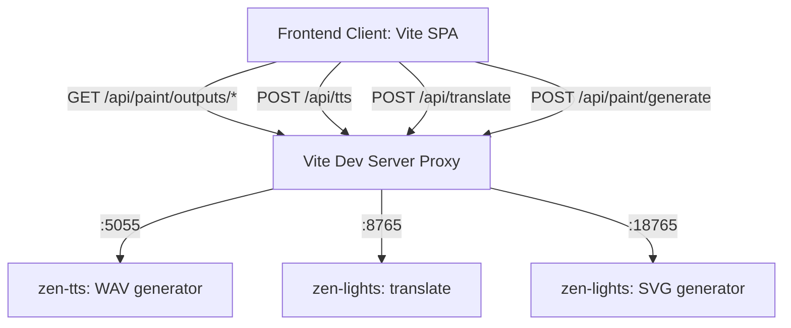

# Zen-Duo: Gamified Passive Language Acquisition

Zen-Duo is a gamified, high-engagement, touch-friendly language learning web application designed for children to acquire English vocabulary and syntax naturally. By coupling instant vector illustrations with local speech generation, Zen-Duo strikes kids' curiosity without forcing dry grammar theories.

---

## 🎯 Project Goals

1. **Passive Acquisition**: Bypass traditional instruction blocks. Children interact with tactile elements, sounds, and visuals to absorb word meanings and relationships.
2. **Curiosity-Driven Interaction**: Promote sandbox spaces where kids search any word to hear and visualize it instantly.
3. **Touchscreen Optimized**: Designed for mobile tablets, with large tap zones, 3D buttons, and clear interactive feedback.
4. **Zero Cloud Latency**: Powered entirely by local AI models (`zen-tts` and `zen-lights` SVG paints) running on local host ports.

---

## 🏗️ System Architecture

### 1. Frontend SPA Layer
- **`main.js`**: Core game controller managing state (XP, hearts, streaks, child profiles, custom coloring gallery) and switching between interactive views:
  - **Learn Map**: Interactive winding path containing 20+ thematic levels with category filters.
  - **Lesson Mode**: Interactive game modes (matching pairs, multiple choices, listening, yes-no, drag-sort, speaking/STT validation).
  - **Curiosity Sandbox**: Vocabulary canvas rendering inline SVGs with manual path coloring palettes and gallery exporters.
  - **Auto Review**: Hands-free background slideshow mode for vocabulary assimilation.
  - **Reading Foundation**: Trace-based Phonics drawing canvas, sight-word memory decks, and AI Illustrated Story Builder.
  - **Parent Portal**: PIN-protected administration console supporting weekly charts, limits, translation toggles, and cutout prints.
- **`style.css`**: Design tokens utilizing custom playful fonts (`Fredoka`), active 3D button animations, dark/light color variations, and printer-friendly overrides.

### 2. Local Service Layer (Proxied via Vite)
- **TTS Endpoint (`/api/tts`)**: Generates audio streams utilizing local speech models, with URL caches to minimize redundant hits.
- **STT Endpoint (`/api/stt`)**: Captures child pronunciation audio and verifies correctness against target words using local AI speech recognition.
- **Translate Endpoint (`/api/translate`)**: Translates vocabulary terms to Vietnamese.
- **Paint Endpoint (`/api/paint`)**: Queries Lucide vectors instantly and falls back to custom SVG generation using a local Qwen-Coder model.

### 3. Advanced Features & Gamification
- **Smart Learning Engine (SRS)**: Implements adaptive spacing queues for incorrect terms, tracking word mastery metrics (1–5 scale).
- **Profile Launcher**: Custom profile switcher allowing up to 4 children with unique stats, avatars, companion pets, and level progression.
- **Reward Cabin & Store**: Shop containing custom pet companions and wearable outfits (astronaut, wizard, ninja, etc.) purchasable with earned Gems.
- **PWA Integration**: Service worker precaching rules enabling standalone full-screen mobile app support.

