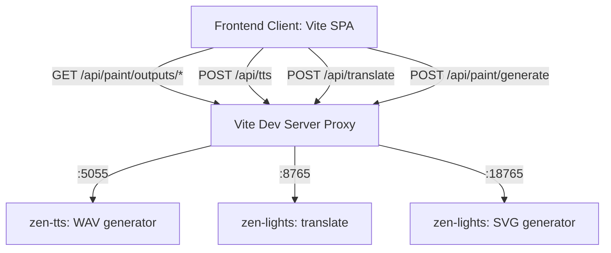

# Zen-Duo: Gamified Passive Language Acquisition

Zen-Duo is a gamified, high-engagement, touch-friendly language learning web application designed for children to acquire English vocabulary and syntax naturally. By coupling instant vector illustrations with local speech generation, Zen-Duo strikes kids' curiosity without forcing dry grammar theories.

---

## 🎯 Project Goals

1. **Passive Acquisition**: Bypass traditional instruction blocks. Children interact with tactile elements, sounds, and visuals to absorb word meanings and relationships.
2. **Curiosity-Driven Interaction**: Promote sandbox spaces where kids search any word to hear and visualize it instantly.
3. **Touchscreen Optimized**: Designed for mobile tablets, with large tap zones, 3D buttons, and clear interactive feedback.
4. **Zero Cloud Latency**: Powered entirely by local AI models (`zen-tts` and `zen-lights` SVG paints) running on local host ports.

---

## 🏗️ System Architecture

### 1. Frontend SPA Layer
- **`main.js`**: Core game controller managing state (XP, hearts, streaks) and switching between four views:
  - **Learn Map**: Game-map path containing levels.
  - **Lesson Mode**: The standard challenge sequence (matching pairs, choices, listening tasks, sentence building).
  - **Curiosity Sandbox**: Real-time illustration and pronunciation playground.
  - **Auto Review**: Hands-free background slideshow mode.
- **`style.css`**: Design tokens utilizing custom playful fonts (`Fredoka`), satisfying 3D button animations, and dark/light color variations.

### 2. Local Service Layer (Proxied via Vite)
- **TTS Endpoint (`/api/tts`)**: Generates and plays audio streams. Implements client-side URL caches to prevent server spam on double-clicks.
- **Translate Endpoint (`/api/translate`)**: Translates terms to Vietnamese.
- **Paint Endpoint (`/api/paint`)**: Queries a hybrid engine:
  - Returns raw Lucide vector files in under 5ms for standard terms.
  - Falls back to custom SVG generation using a lightweight 1.5B Qwen-Coder LLM running on CPU.
